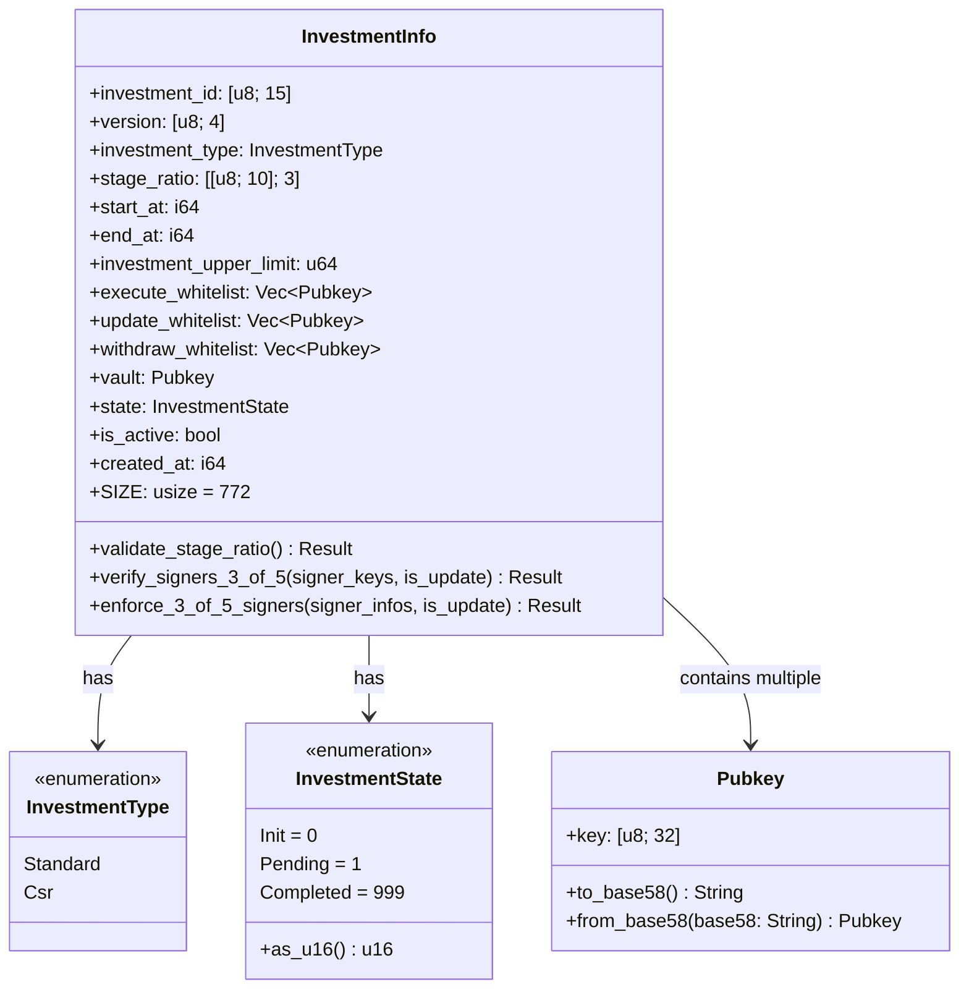
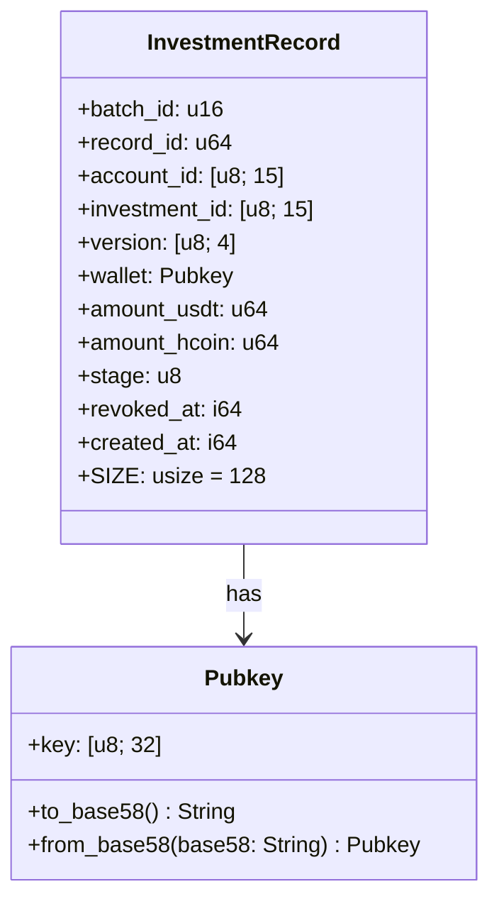

# InvestmentInfo & InvestmentRecord UML Class Diagram

## Overview

This document contains UML class diagrams for the core data structures in the H2Coin Vault Share Protocol: `InvestmentInfo` and `InvestmentRecord`.

## InvestmentInfo Class Diagram



## InvestmentRecord Class Diagram



## Relationship Diagram

```mermaid
classDiagram
    class InvestmentInfo {
        +investment_id: [u8; 15]
        +version: [u8; 4]
        +investment_type: InvestmentType
        +stage_ratio: [[u8; 10]; 3]
        +start_at: i64
        +end_at: i64
        +investment_upper_limit: u64
        +execute_whitelist: Vec~Pubkey~
        +update_whitelist: Vec~Pubkey~
        +withdraw_whitelist: Vec~Pubkey~
        +vault: Pubkey
        +state: InvestmentState
        +is_active: bool
        +created_at: i64
    }

    class InvestmentRecord {
        +batch_id: u16
        +record_id: u64
        +account_id: [u8; 15]
        +investment_id: [u8; 15]
        +version: [u8; 4]
        +wallet: Pubkey
        +amount_usdt: u64
        +amount_hcoin: u64
        +stage: u8
        +revoked_at: i64
        +created_at: i64
    }

    class InvestmentType {
        <<enumeration>>
        Standard
        Csr
    }

    class InvestmentState {
        <<enumeration>>
        Init
        Pending
        Completed
    }

    class Pubkey {
        +key: [u8; 32]
    }

    InvestmentInfo ||--o{ InvestmentRecord : "1 to many"
    InvestmentInfo --> InvestmentType : has
    InvestmentInfo --> InvestmentState : has
    InvestmentInfo --> Pubkey : "contains multiple (whitelists)"
    InvestmentRecord --> Pubkey : has
```

## Detailed Field Descriptions

### InvestmentInfo Fields

| Field | Type | Size | Description |
|-------|------|------|-------------|
| `investment_id` | `[u8; 15]` | 15 bytes | Unique investment identifier |
| `version` | `[u8; 4]` | 4 bytes | Program version or Git commit hash |
| `investment_type` | `InvestmentType` | 1 byte | Investment category (Standard/Csr) |
| `stage_ratio` | `[[u8; 10]; 3]` | 30 bytes | Refund/share ratio for each stage |
| `start_at` | `i64` | 8 bytes | Investment start timestamp |
| `end_at` | `i64` | 8 bytes | Investment end timestamp |
| `investment_upper_limit` | `u64` | 8 bytes | Maximum USDT accepted |
| `execute_whitelist` | `Vec<Pubkey>` | 164 bytes | 5 pubkeys for profit/refund execution |
| `update_whitelist` | `Vec<Pubkey>` | 164 bytes | 5 pubkeys for configuration updates |
| `withdraw_whitelist` | `Vec<Pubkey>` | 164 bytes | 5 pubkeys for vault withdrawals |
| `vault` | `Pubkey` | 32 bytes | Vault PDA for funds |
| `state` | `InvestmentState` | 2 bytes | Current investment status |
| `is_active` | `bool` | 1 byte | Whether investment is active |
| `created_at` | `i64` | 8 bytes | Creation timestamp |

### InvestmentRecord Fields

| Field | Type | Size | Description |
|-------|------|------|-------------|
| `batch_id` | `u16` | 2 bytes | Grouping ID for batch processing |
| `record_id` | `u64` | 8 bytes | Unique record identifier |
| `account_id` | `[u8; 15]` | 15 bytes | Business-level investor ID |
| `investment_id` | `[u8; 15]` | 15 bytes | Investment this record belongs to |
| `version` | `[u8; 4]` | 4 bytes | Version of investment program |
| `wallet` | `Pubkey` | 32 bytes | Investor's wallet address |
| `amount_usdt` | `u64` | 8 bytes | Invested amount in USDT |
| `amount_hcoin` | `u64` | 8 bytes | H2COIN reward amount |
| `stage` | `u8` | 1 byte | Investment stage (0-2) |
| `revoked_at` | `i64` | 8 bytes | Revocation timestamp (0 if active) |
| `created_at` | `i64` | 8 bytes | Record creation timestamp |

## Key Relationships

### 1. InvestmentInfo → InvestmentRecord (1:Many)
- One `InvestmentInfo` can have multiple `InvestmentRecord` instances
- Records are linked via `investment_id` and `version`
- Records are grouped by `batch_id` for processing

### 2. InvestmentInfo → Whitelists (1:Many)
- Each `InvestmentInfo` maintains three whitelists of 5 `Pubkey` each
- `execute_whitelist`: For profit/refund execution
- `update_whitelist`: For configuration updates
- `withdraw_whitelist`: For vault withdrawals

### 3. InvestmentRecord → Pubkey (1:1)
- Each record has one associated wallet `Pubkey`
- Wallet can be updated through `update_investment_record_wallets`

## Validation Rules

### InvestmentInfo Validation
- `validate_stage_ratio()`: Ensures stage ratios are valid (≤ 100)
- `verify_signers_3_of_5()`: Validates 3-of-5 multisig requirements
- `enforce_3_of_5_signers()`: Enforces signature requirements

### InvestmentRecord Validation
- PDA uniqueness via deterministic seeds
- Account ID consistency across updates
- Revocation status tracking via `revoked_at`

## Size Calculations

### InvestmentInfo Total Size: 772 bytes
- 8 bytes discriminator
- 15 bytes investment_id
- 4 bytes version
- 1 byte investment_type
- 30 bytes stage_ratio
- 8 bytes start_at
- 8 bytes end_at
- 8 bytes investment_upper_limit
- 164 bytes execute_whitelist (4 + 32×5)
- 164 bytes update_whitelist (4 + 32×5)
- 164 bytes withdraw_whitelist (4 + 32×5)
- 32 bytes vault
- 2 bytes state
- 1 byte is_active
- 8 bytes created_at

### InvestmentRecord Total Size: 128 bytes
- 8 bytes discriminator
- 2 bytes batch_id
- 8 bytes record_id
- 15 bytes account_id
- 15 bytes investment_id
- 4 bytes version
- 32 bytes wallet
- 8 bytes amount_usdt
- 8 bytes amount_hcoin
- 1 byte stage
- 8 bytes revoked_at
- 8 bytes created_at
``` 