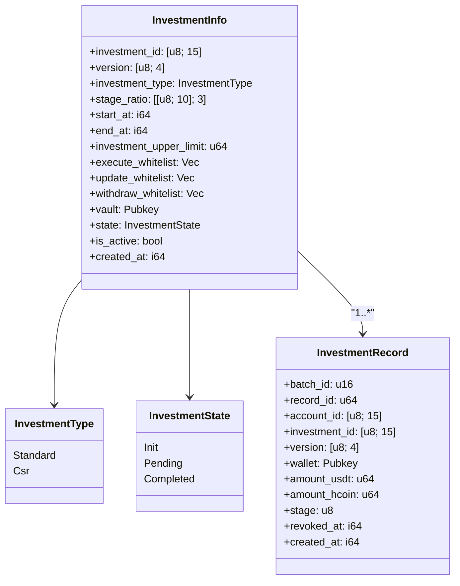

# 📜 `InvestmentInfo` Specification: H2Coin Vault Share Protocol

## 📘 Module: `InvestmentInfo`

This document describes the structure and behavior of the InvestmentInfo account in the H2Coin Vault Share Protocol.

**Related Documents:**
- [InvestmentRecord Specification](./InvestmentRecord_spec.md) - Related record structure
- [Profit Distribution Flow](./Profit_Distribution_Flow.md) - Overall system flow

---

## 📦 Account: `InvestmentInfo`

The InvestmentInfo account is used to define, control, and govern a specific investment project. It encapsulates all necessary configuration and security logic, such as distribution ratios, governance whitelists, lifecycle status, and the vault linkage. It is uniquely identified by a PDA derived from the investment ID and version.

This account:

*   Serves as the canonical source of truth for an investment project
*   Is referenced by other PDAs like vaults, investment records, and profit/refund caches
*   Drives the state machine of the investment through instructions like complete, deactivate, etc.
*   Enforces 3-of-5 multisig authorization for critical updates

---

## 🧭 Interpretation

The InvestmentInfo account represents a unique investment project configuration and status. It defines all the essential parameters and governance rules required to manage the investment lifecycle on-chain.

This account:

*   Acts as the central reference for any vault, record, or distribution operations
*   Stores key metadata like timeframes, whitelist governance, and distribution ratios
*   Is a PDA derived from `investment_id` and version, making it unique and secure
*   Controls the state transition of an investment: Init → Pending → Completed → Deactivated
*   Is validated before any on-chain instructions (e.g., add record, refund, profit share)

---

### 🧮 PDA Derivation

```
seeds = [
            b"profit_cache", 
            investment_info.investment_id.as_ref(),
            investment_info.version.as_ref(),
        ],
        
PDA = find_program_address(seeds, program_id)
```

### 🧮 Struct: `InvestmentInfo` and Size Calculation

| Field | Type | Size (Bytes) | Description |
| --- | --- | --- | --- |
| discriminator | — | 8 | Anchor account discriminator |
| `investment_id` | `[u8; 15]` | 15 | Unique investment identifier |
| version | `[u8; 4]` | 4 | Program version or Git commit hash |
| `investment_type` | `[u8; 16]` | 16 | Investment category/type |
| `stage_ratio` | `[[u8; 10]; MAX_STAGE]` | 30 | Refund/share ratio for each stage (3 × 10) |
| `start_at` | `i64` | 8 | Investment start timestamp |
| `end_at` | `i64` | 8 | Investment end timestamp |
| `investment_upper_limit` | `u64` | 8 | Max USDT accepted |
| `execute_whitelist` | `Vec<Pubkey>` | 4 + 32×5 = 164 | Pubkeys authorized to execute profit/refund |
| `update_whitelist` | `Vec<Pubkey>` | 4 + 32×5 = 164 | Pubkeys authorized to update config |
| `withdraw_whitelist` | `Vec<Pubkey>` | 4 + 32×5 = 164 | Pubkeys allowed to withdraw |
| vault | `Pubkey` | 32 | Vault PDA for funds |
| state | `InvestmentState` (`u16`) | 2 | Enum: `Init`, `Pending`, `Completed` |
| `is_active` | `bool` | 1 | Whether investment is active |
| `created_at` | `i64` | 8 | Creation timestamp |
| **Total** | — | **772** | Total account size |

#### Constants

*   `SIZE` = 772 bytes
*   `MAX_STAGE` = 3
*   `MAX_WHITELIST_LEN` = 5

### 📊 UML Class Diagram



> InvestmentInfo 與 InvestmentRecord 之間為一對多關係，詳細請見 [InvestmentRecord 規格](./InvestmentRecord_spec.md)。

---

### 📘 Enum: `InvestmentState`

```
#[repr(u16)]
pub enum InvestmentState {
    Init = 0,
    Pending = 1,
    Completed = 999,
}
```

Used to track current investment status.

---

### ✅ Validation Rules

*   `validate_stage_ratio()`
    *   All stage values must be ≤ 100
    *   Non-contiguous years (non-zero followed by non-zero) are invalid
    *   Each stage's total ratio must be ≤ 100
*   `