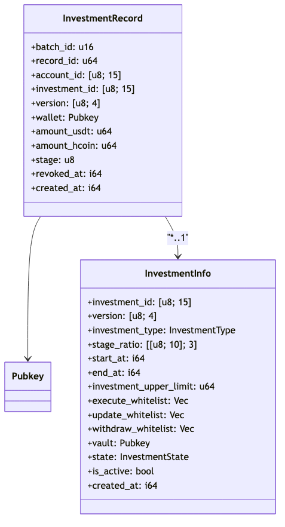

# 📜 `InvestmentRecord` Specification: H2Coin Vault Share Protocol

This document describes the structure, purpose, and instruction behaviors for the `InvestmentRecord` account in the H2Coin Vault Share Protocol.

---

## 📦 Account: `InvestmentRecord`

The `InvestmentRecord` account represents a **single investor's participation entry** within a specific investment project. Each record captures the USDT amount contributed, the H2COIN reward calculated, wallet info, and the investor's designated investment stage.

This account:

*   Is uniquely identified via a PDA derived from `investment_id`, `version`, `batch_id`, `record_id`, and `account_id`
*   Is tied to an `InvestmentInfo` project and supports **multi-stage**, **multi-batch** investor records
*   Can be updated (e.g., wallet change) or revoked (e.g., disqualification) through on-chain instructions

---

## 🧭 Interpretation

The `InvestmentRecord` is the **atomic investment unit** tracking how much an investor contributed and under which stage. It is essential for computing profit/refund shares and validating eligibility.

Each record:

*   Is immutable once added (except for wallet update or revocation)
*   Enables batch-level grouping via `batch_id`
*   Supports future updates (wallet patching) and revocation logic
*   Guarantees uniqueness via deterministic PDA seeds

---

## 🔐 PDA Derivation

```
Seeds = [
  "record",
  investment_id,
  version,
  batch_id (LE),
  record_id (LE),
  account_id,
]
PDA = find_program_address(seeds, program_id)
```

This ensures deterministic uniqueness for each investor entry.

---

## 📦 Struct: `InvestmentRecord`

| Field | Type | Size (Bytes) | Description |
| --- | --- | --- | --- |
| `discriminator` | `[u8; 8]` | 8 | Anchor account discriminator |
| `batch_id` | u16 | 2 | Grouping ID for batch-based processing |
| `record_id` | u64 | 8 | Unique per-investment record ID |
| `account_id` | `[u8; 15]` | 15 | Business-level unique ID for the investor |
| `investment_id` | `[u8; 15]` | 15 | The investment this record belongs to |
| `version` | `[u8; 4]` | 4 | Version of the investment program |
| `wallet` | Pubkey | 32 | Investor's wallet address |
| `amount_usdt` | u64 | 8 | Invested amount in USDT |
| `amount_hcoin` | u64 | 8 | H2COIN reward amount |
| `stage` | u8 | 1 | Stage (1, 2, or 3) used for ratio distribution |
| `revoked_at` | i64 | 8 | Timestamp if this record was revoked |
| `created_at` | i64 | 8 | Record creation time |

> ✅ **Total Size**: 128 bytes

### 📊 UML Class Diagram



> InvestmentRecord belongs to InvestmentInfo and is linked via investment_id and version. For details, see the [InvestmentInfo](./InvestmentInfo_spec.md).

---

## 🛠 Instruction Behaviors

*   `**add_investment_record**`
    *   Adds a new record to the given investment
    *   Requires 3-of-5 update whitelist multisig
    *   Validates PDA and prevents overwrite
    *   Emits `InvestmentRecordAdded`
*   `**update_investment_record_wallets**`
    *   Allows changing the wallet address for existing records with matching `account_id`
    *   Requires 3-of-5 update whitelist multisig
    *   Validates matching `InvestmentInfo`, `account_id`, and correct record PDA
    *   Emits `InvestmentRecordWalletUpdated`
*   `**revoked_investment_record**`
    *   Soft-deletes (revokes) the record by setting `revoked_at`
    *   Requires 3-of-5 update whitelist multisig
    *   Validates matching PDAs and account\_id consistency
    *   Emits `InvestmentRecordRevoked`

---

✅ This document is audit-ready and reflects the latest `InvestmentRecord` logic.