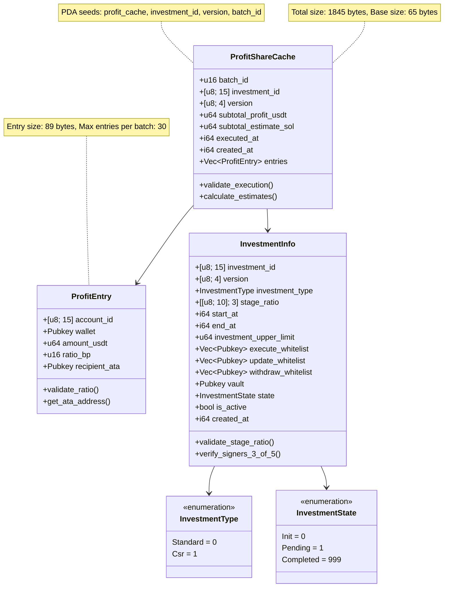

# `📜 ProfitShareCache` Specification: H2Coin Vault Share Protocol

## 📘 Module: `ProfitShareCache`

This document specifies the `ProfitShareCache` structure and its role in the H2Coin Vault Share Protoal. It is designed for audit and documentation purposes.

---

## 📦 Account: `ProfitShareCache`

The `ProfitShareCache` account is used to **cache batched profit-sharing entries** for a specific investment project (`investment_id`). Each cache contains up to 100 profit recipients and is used to prevent duplicated execution and manage profit distribution gas costs.

### 🧮 PDA Derivation

```
seeds = [
            b"profit_cache", 
            investment_info.investment_id.as_ref(),
            investment_info.version.as_ref(),
            batch_id.to_le_bytes().as_ref(),
        ],
        
 PDA = find_program_address(seeds, program_id)
```

### 🧮 Struct: `ProfitShareCache` and Size Calculation

| Field | Type | Size (Bytes) | Description |
| --- | --- | --- | --- |
| `discriminator` | — | 8 | Anchor discriminator |
| `batch_id` | `u16` | 2 | ALT batch ID |
| `investment_id` | `[u8; 15]` | 15 | Investment reference |
| `version` | `[u8; 4]` | 4 | Version |
| `subtotal_profit_usdt` | `u64` | 8 | Total USDT to distribute |
| `subtotal_estimate_sol` | `u64` | 8 | Estimated SOL to execute |
| `executed_at` | `i64` | 8 | Timestamp if executed |
| `created_at` | `i64` | 8 | Cache creation time |
| `entries (prefix)` | `Vec<ProfitEntry>` | 4 | Vec length prefix |
| `entries` | — | 89 × N | Profit entries (N ≤ `MAX_ENTRIES_PER_BATCH`) |
| **Total (N=30)** | — | **1845** | Size with 30 entries |

### 🧮 Struct: `ProfitEntry` (used in `entries`) and Size Calculation

| Field | Type | Size (Bytes) | Description |
| --- | --- | --- | --- |
| `account_id` | `[u8; 15]` | 15 | Account ID |
| `wallet` | `Pubkey` | 32 | Wallet address |
| `amount_usdt` | `u64` | 8 | USDT share |
| `ratio_bp` | `u16` | 2 | Ratio in basis points |
| `recipient_ata` | `Pubkey` | 32 | Associated token address |
| **Total** | — | 89 | Entry size |

#### Constants

*   `ENTRY_SIZE` = 89 bytes
*   `BASE_SIZE` = 65 bytes (without entries)
*   `SIZE` = 1845 (with entries)
*   `MAX_ENTRIES_PER_BATCH` = 30
*   `ESTIMATE_SOL_BASE` = 100\_000
*   `ESTIMATE_SOL_PER_ENTRY` = 5\_000

---

#### Notes

*   Each `ProfitShareCache` stores up to 30 entries.
*   `executed_at` ensures idempotent execution (only run once).
*   Calculations are done off-chain and verified by 3-of-5 multisig.
*   `ratio_bp` must be between 1 and 10,000 (basis points).
*   Sum of all `amount_usdt` must equal `subtotal_profit_usdt`
*   `recipient_ata` must be derived from `wallet + mint`

#### Security Considerations

*   `executed_at` prevents re-execution of the same batch.
*   Entries are generated off-chain by authorized signers.
*   The `execute_profit_share` instruction verifies:
    *   3-of-5 multisignature approval from the execute whitelist
    *   Sufficient USDT and SOL balances in the vault
    *   That the PDA and batch have not been executed yet

## 🛠 Related Instructions Overview

| Instruction | Description |
| --- | --- |
| `estimate_profit_share` | Generates entries and stores `ProfitShareCache` |
| `execute_profit_share` | Transfers USDT to investors |
| `reset_profit_cache` (optional) | Manually clears a cache in devnet/testnet |

---

## 🧪 Instruction Details

### 1\. `estimate_profit_share`

Generates profit share entries and stores them in a new `ProfitShareCache`.

#### ⚙️ Inputs

*   `investment_info`: Reference to investment ID and version
*   `batch_id`: Unique ID for the group (e.g. 0, 1, 2)
*   `off-chain input`: List of profit entries to include (not passed directly on-chain)

#### 📋 Process

*   Derives PDA using `investment_id`, version, `batch_id`
*   Validates:
    *   `InvestmentInfo.state == Completed`
    *   `total_usdt > 0`
    *   No existing ProfitShareCache with same batch
*   Calculates:
    *   `subtotal_profit_usdt` = sum of all entries
    *   `subtotal_estimate_sol` = estimated gas for this batch
*   Caches all entries in an `AnchorAccount`

#### 🛡 Validations

*   Only callable once per batch (based on PDA existence)
*   Total must match InvestmentSummary USDT
*   Maximum entries: 30
*   Ratios must sum to ~100%

---

### 2\. `execute_profit_share`

Distributes USDT from vault to each `recipient_ata` listed in the cache.

#### ⚙️ Inputs

*   `vault`: PDA derived from `investment_id`, `version`
*   `usdt_mint`: USDT mint used for ATA
*   `ProfitShareCache`: Cached data from previous step
*   `Whitelist signers`: 3-of-5 multisig accounts

#### 🧾 Execution Steps

*   Verifies:
    *   3 of 5 `execute_whitelist` signers
    *   Vault contains sufficient USDT
    *   `executed_at == 0` (not already executed)
*   Transfers:
    *   For each entry, transfer `amount_usdt` from vault to recipient ATA
*   Updates:
    *   Marks `executed_at` timestamp to prevent re-execution

#### 🛡 Validations

*   Vault token account must match expected USDT mint
*   ATA auto-creation supported (if needed)
*   Transaction limited by compute units and `MAX_ENTRIES_PER_BATCH`

## 📌 Summary

`ProfitShareCache` enables secure, batched, and gas-efficient profit distribution for up to 30 investors per batch.

Each batch is immutable once created, and prevents double execution via the `executed_at` flag.

One cache per `investment_id` + version + `batch_id pair`.

---

✅ This document is audit-ready and reflects the latest `ProfitShareCache` logic.

## 📊 ProfitShareCache Class Diagram

### Mermaid Source


### Diagram

