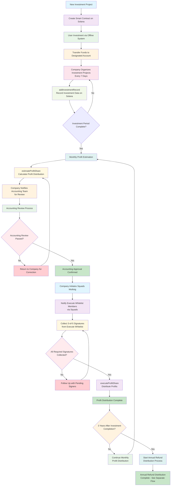

# Profit Distribution Flow

## Overview

This document describes the profit distribution flow for the H2Coin Vault Share system. The process involves creating investment projects, recording investments, and distributing profits through Solana smart contracts.

## Process Flow

### 1. Investment Project Creation
When a new investment project is added to the system, a corresponding smart contract is created on Solana blockchain.

### 2. User Investment Process
Users add investments through the company's offline system and transfer investment amounts to designated accounts.

### 3. Investment Record Management
The company regularly organizes investment projects (every 7 days) and records investment information on Solana using the `addInvestmentRecord` function.

### 4. Profit Distribution with Accounting Review
After investment completion, the company monthly executes `estimateProfitShare` to estimate profit distribution for each investment record. The company then notifies the accounting team for review. After accounting approval, the company initiates Squads multisig to collect 3-of-5 signatures from the execute whitelist before executing `executeProfitShare` to distribute profits.

### 5. Annual Refund Distribution (Starting Year 3)
Starting from the third year after investment completion, the company annually executes `estimateRefundShare` to calculate H2COIN refund distribution based on investment stage ratios. After accounting review and approval, the company collects 3-of-5 signatures via Squads multisig before executing `executeRefundShare` to distribute H2COIN refunds to investors.

## Flow Diagram



## Annual Refund Distribution Flow Diagram

```mermaid
flowchart TD
    A1[Investment Completed<br/>3 Years Ago] --> B1[Annual Refund Estimation<br/>Starting Year 3]
    B1 --> C1[estimateRefundShare<br/>Calculate H2COIN Refund]
    C1 --> D1[Company Notifies Accounting Team<br/>for Refund Review]
    D1 --> E1[Accounting Review Process<br/>for Refund Distribution]
    E1 --> F1{Accounting Review Passed?}
    F1 -->|No| G1[Return to Company for Correction]
    G1 --> C1
    F1 -->|Yes| H1[Accounting Approval Confirmed]
    H1 --> I1[Company Initiates Squads Multisig<br/>for Refund Execution]
    I1 --> J1[Notify Execute Whitelist Members<br/>via Squads for Refund]
    J1 --> K1[Collect 3-of-5 Signatures<br/>from Execute Whitelist]
    K1 --> L1{All Required Signatures<br/>Collected?}
    L1 -->|No| M1[Follow Up with Pending Signers]
    M1 --> K1
    L1 -->|Yes| N1[executeRefundShare<br/>Distribute H2COIN Refunds]
    N1 --> O1[Annual Refund Distribution Complete]
    O1 --> P1{Continue Next Year?}
    P1 -->|Yes| Q1[Wait for Next Year]
    Q1 --> R1[Next Year Refund Estimation]
    R1 --> S1[estimateRefundShare<br/>Calculate H2COIN Refund<br/>for Next Year]
    S1 --> T1[Company Notifies Accounting Team<br/>for Next Year Refund Review]
    T1 --> U1[Accounting Review Process<br/>for Next Year Refund]
    U1 --> V1{Next Year Accounting<br/>Review Passed?}
    V1 -->|No| W1[Return to Company for Correction]
    W1 --> S1
    V1 -->|Yes| X1[Next Year Accounting<br/>Approval Confirmed]
    X1 --> Y1[Company Initiates Squads Multisig<br/>for Next Year Refund]
    Y1 --> Z1[Notify Execute Whitelist Members<br/>via Squads for Next Year Refund]
    Z1 --> AA1[Collect 3-of-5 Signatures<br/>from Execute Whitelist]
    AA1 --> BB1{All Required Signatures<br/>Collected for Next Year?}
    BB1 -->|No| CC1[Follow Up with Pending Signers]
    CC1 --> AA1
    BB1 -->|Yes| DD1[executeRefundShare<br/>Distribute H2COIN Refunds<br/>for Next Year]
    DD1 --> EE1[Next Year Refund Distribution Complete]
    EE1 --> FF1{Continue Next Year?}
    FF1 -->|Yes| Q1
    FF1 -->|No| GG1[All Refunds Completed]
    
    style A1 fill:#e1f5fe
    style B1 fill:#e0f2f1
    style C1 fill:#fff8e1
    style D1 fill:#fff3e0
    style E1 fill:#e8f5e8
    style F1 fill:#ffebee
    style G1 fill:#ffcdd2
    style H1 fill:#c8e6c9
    style I1 fill:#e1f5fe
    style J1 fill:#f3e5f5
    style K1 fill:#fff8e1
    style L1 fill:#ffebee
    style M1 fill:#ffcdd2
    style N1 fill:#f3e5f5
    style O1 fill:#c8e6c9
    style P1 fill:#fff3e0
    style Q1 fill:#e8f5e8
    style R1 fill:#e0f2f1
    style S1 fill:#fff8e1
    style T1 fill:#fff3e0
    style U1 fill:#e8f5e8
    style V1 fill:#ffebee
    style W1 fill:#ffcdd2
    style X1 fill:#c8e6c9
    style Y1 fill:#e1f5fe
    style Z1 fill:#f3e5f5
    style AA1 fill:#fff8e1
    style BB1 fill:#ffebee
    style CC1 fill:#ffcdd2
    style DD1 fill:#f3e5f5
    style EE1 fill:#c8e6c9
    style FF1 fill:#fff3e0
    style GG1 fill:#4caf50
```



## Smart Contract Functions Details

### 1. addInvestmentRecord
**Purpose**: Records investment information on Solana blockchain for a specific batch.

**Required Parameters**:
- `batch_id: u16` - Batch identifier for grouping records
- `record_id: u64` - Unique record identifier
- `account_id: [u8; 15]` - Fixed-length account identifier (15 bytes)
- `amount_usdt: u64` - Investment amount in USDT (6 decimals)
- `amount_hcoin: u64` - Investment amount in H2COIN (6 decimals)
- `stage: u8` - Investment stage (0-2)

**Required Accounts**:
- `investment_info` - Investment configuration PDA
- `investment_record` - Record storage PDA
- `payer` - Transaction fee payer
- `system_program` - System program for account creation

**Signature Requirements**: 
- **3-of-5 multisig** from `update_whitelist` or `execute_whitelist`
- At least 3 valid signatures from the 5-member whitelist

### 2. estimateProfitShare
**Purpose**: Estimates profit distribution for a specific batch of investment records.

**Required Parameters**:
- `batch_id: u16` - Target batch identifier
- `total_profit_usdt: u64` - Total profit to distribute in USDT (6 decimals)
- `total_invest_usdt: u64` - Total investment amount in USDT (6 decimals)

**Required Accounts**:
- `investment_info` - Investment configuration PDA
- `cache` - Profit share cache PDA (created if not exists)
- `payer` - Transaction fee payer
- `rent` - Rent sysvar
- `system_program` - System program

**Additional Data Accounts**:
- Up to 255 investment record accounts for the batch
- Signer accounts for authorization

**Signature Requirements**:
- **3-of-5 multisig** from `execute_whitelist` or `update_whitelist`
- At least 3 valid signatures from the 5-member whitelist

**Validation Rules**:
- Investment must be active and completed
- Investment type must be Standard (not CSR)
- All records must have valid account IDs
- Revoked records are skipped

### 3. executeProfitShare
**Purpose**: Executes actual profit distribution to investor wallets.

**Required Parameters**:
- `batch_id: u16` - Target batch identifier

**Required Accounts**:
- `investment_info` - Investment configuration PDA
- `cache` - Profit share cache PDA (must exist)
- `mint` - USDT token mint
- `vault` - Vault PDA holding funds
- `vault_token_account` - Vault's USDT token account
- `payer` - Transaction fee payer
- `token_program` - SPL Token program
- `associated_token_program` - Associated Token Account program

**Signature Requirements**:
- **3-of-5 multisig** from `execute_whitelist`
- At least 3 valid signatures from the 5-member execute whitelist

**Validation Rules**:
- Cache must not be previously executed (`executed_at == 0`)
- Vault must have sufficient USDT balance
- All recipient token accounts must exist or be created

### 4. estimateRefundShare
**Purpose**: Estimates H2COIN refund distribution for a specific batch based on investment stage ratios and year index.

**Required Parameters**:
- `batch_id: u16` - Target batch identifier
- `year_index: u8` - Year index for refund calculation (starting from year 3)

**Required Accounts**:
- `investment_info` - Investment configuration PDA
- `cache` - Refund share cache PDA (created if not exists)
- `payer` - Transaction fee payer
- `rent` - Rent sysvar
- `system_program` - System program

**Additional Data Accounts**:
- Up to 255 investment record accounts for the batch
- Signer accounts for authorization

**Signature Requirements**:
- **3-of-5 multisig** from `execute_whitelist` or `update_whitelist`
- At least 3 valid signatures from the 5-member whitelist

**Validation Rules**:
- Investment must be active and completed
- Year index must be valid (≥ 3)
- Stage ratios must exist for the investment
- Investment records must match the specified stage

### 5. executeRefundShare
**Purpose**: Executes actual H2COIN refund distribution to investor wallets.

**Required Parameters**:
- `batch_id: u16` - Target batch identifier
- `year_index: u8` - Year index for refund execution

**Required Accounts**:
- `investment_info` - Investment configuration PDA
- `cache` - Refund share cache PDA (must exist)
- `mint` - H2COIN token mint
- `vault` - Vault PDA holding funds
- `vault_token_account` - Vault's H2COIN token account
- `payer` - Transaction fee payer
- `token_program` - SPL Token program
- `associated_token_program` - Associated Token Account program

**Signature Requirements**:
- **3-of-5 multisig** from `execute_whitelist`
- At least 3 valid signatures from the 5-member execute whitelist

**Validation Rules**:
- Cache must not be previously executed (`executed_at == 0`)
- Vault must have sufficient H2COIN balance
- All recipient token accounts must exist or be created

## Multi-Signature Security Model

### Whitelist Structure
Each investment project maintains three separate whitelists:

1. **Execute Whitelist** (`execute_whitelist: Vec<Pubkey>`)
   - 5 authorized signers for profit/refund execution
   - Required for: `executeProfitShare`, `executeRefundShare`

2. **Update Whitelist** (`update_whitelist: Vec<Pubkey>`)
   - 5 authorized signers for investment updates
   - Required for: `updateInvestmentInfo`, `addInvestmentRecord`

3. **Withdraw Whitelist** (`withdraw_whitelist: Vec<Pubkey>`)
   - 5 authorized signers for vault withdrawals
   - Required for: `withdrawFromVault`

### 3-of-5 Signature Enforcement
```rust
// Example validation logic
info.enforce_3_of_5_signers(signer_infos, is_update)?;

// Validation checks:
// 1. Whitelist must have exactly 5 members
// 2. At least 3 signers must be from the appropriate whitelist
// 3. All signers must be valid (is_signer = true)
```

### Time Intervals
- **Investment Organization**: Every 7 days
- **Profit Estimation**: Monthly after investment completion
- **Accounting Review**: Within 3-5 business days after estimation
- **Multisig Collection**: Within 2-3 business days after accounting approval
- **Annual Refund Estimation**: Starting from year 3 after investment completion
- **Refund Accounting Review**: Within 3-5 business days after refund estimation
- **Refund Multisig Collection**: Within 2-3 business days after refund accounting approval

### Process Validation
- Investment data verification before recording
- Accounting review and approval for profit distribution
- Multisig signature collection and validation
- Blockchain transaction confirmation
- Annual refund calculation based on investment stage ratios
- Refund accounting review and approval
- Refund multisig signature collection and validation

## Security Considerations

### Access Control & Authorization
1. **Multi-Signature Requirements**: All critical operations require 3-of-5 multisig approval
2. **Whitelist Separation**: Execute, update, and withdraw permissions are strictly separated
3. **Role-Based Access**: Different whitelists control different types of operations
4. **Authorization Validation**: Every transaction validates signer permissions on-chain

### Data Integrity & Validation
1. **Immutable Records**: All investment records are stored on Solana blockchain
2. **PDA Protection**: All critical accounts use Program Derived Addresses (PDAs)
3. **State Validation**: Investment must be active and completed before profit distribution
4. **Cache Protection**: Profit share cache prevents double execution

### Audit & Transparency
1. **Complete Audit Trail**: All operations emit events with signer information
2. **Transaction History**: Full blockchain transaction history for transparency
3. **Event Logging**: Detailed events for profit estimation and execution
4. **Signer Tracking**: All multisig operations log participating signers

### Operational Security
1. **Replay Protection**: Cache `executed_at` timestamp prevents double execution
2. **Balance Validation**: Vault balance checks before distribution
3. **Token Account Validation**: Automatic creation of recipient token accounts
4. **Error Handling**: Comprehensive error codes and validation messages
5. **Accounting Oversight**: Mandatory accounting review before execution
6. **Multisig Workflow**: Squads integration for secure signature collection

## Error Handling & Validation

### Transaction Failures
- **Failed Transactions**: All failed transactions are logged with detailed error codes
- **Retry Mechanisms**: Network issues trigger automatic retry with exponential backoff
- **Error Propagation**: Clear error messages for debugging and monitoring

### Data Validation
- **Invalid Investment Data**: Rejected with specific error codes
- **Insufficient Funds**: Vault balance checks prevent insufficient fund distributions
- **Invalid Signatures**: Unauthorized signers are rejected with detailed logging

### State Protection
- **Double Execution Prevention**: Cache `executed_at` timestamp prevents replay attacks
- **State Consistency**: Investment state validation ensures proper execution order
- **Account Validation**: PDA and token account validation prevents invalid operations

### Recovery Mechanisms
- **Graceful Degradation**: System continues operation even with partial failures
- **Manual Intervention**: Critical errors can be resolved through manual processes
- **Audit Logging**: All errors and recoveries are logged for post-incident analysis
- **Accounting Review Loop**: Failed reviews trigger correction and re-estimation
- **Multisig Follow-up**: Automated reminders for pending signatures

## Accounting Review & Multisig Workflow

### Accounting Review Process

#### 1. Review Notification
- **Trigger**: After `estimateProfitShare` completion
- **Notification Method**: Company internal system notification
- **Review Timeline**: 3-5 business days
- **Review Scope**: 
  - Profit calculation accuracy
  - Investment record validation
  - Distribution ratio verification
  - Compliance with accounting standards

#### 1a. Refund Review Notification
- **Trigger**: After `estimateRefundShare` completion (starting year 3)
- **Notification Method**: Company internal system notification
- **Review Timeline**: 3-5 business days
- **Review Scope**:
  - H2COIN refund calculation accuracy
  - Investment stage ratio validation
  - Year index verification
  - Refund distribution compliance

#### 2. Review Activities
- **Data Verification**: Cross-check estimated profits with investment records
- **Calculation Audit**: Verify profit distribution ratios and amounts
- **Compliance Check**: Ensure adherence to financial regulations
- **Documentation Review**: Validate supporting documentation

#### 2a. Refund Review Activities
- **Data Verification**: Cross-check estimated H2COIN refunds with investment records
- **Calculation Audit**: Verify refund distribution ratios based on stage and year
- **Compliance Check**: Ensure adherence to refund distribution policies
- **Documentation Review**: Validate refund calculation supporting documentation

#### 3. Review Outcomes
- **Approval**: Proceed to multisig collection
- **Rejection**: Return to company for correction and re-estimation
- **Conditional Approval**: Proceed with specific modifications

#### 3a. Refund Review Outcomes
- **Approval**: Proceed to refund multisig collection
- **Rejection**: Return to company for correction and re-estimation
- **Conditional Approval**: Proceed with specific refund modifications

### Squads Multisig Workflow

#### 1. Multisig Initiation
- **Trigger**: After accounting approval
- **Platform**: Squads multisig platform
- **Required Signers**: 3-of-5 from execute whitelist
- **Timeline**: 2-3 business days for signature collection

#### 1a. Refund Multisig Initiation
- **Trigger**: After refund accounting approval (starting year 3)
- **Platform**: Squads multisig platform
- **Required Signers**: 3-of-5 from execute whitelist
- **Timeline**: 2-3 business days for signature collection
- **Annual Schedule**: Once per year starting from year 3

#### 2. Notification Process
- **Primary Notification**: Email/SMS to whitelist members
- **Secondary Notification**: Internal system alerts
- **Escalation**: Follow-up calls for pending signatures
- **Reminder Schedule**: Daily reminders until completion

#### 3. Signature Collection
- **Signature Method**: Digital signatures via Squads platform
- **Validation**: Real-time signature verification
- **Progress Tracking**: Live status updates
- **Timeout Handling**: Automatic escalation after 48 hours

#### 4. Execution Preparation
- **Pre-execution Check**: Final validation of all signatures
- **Transaction Preparation**: Prepare Solana transaction
- **Balance Verification**: Confirm vault has sufficient funds
- **Execution Authorization**: Proceed with `executeProfitShare`

#### 4a. Refund Execution Preparation
- **Pre-execution Check**: Final validation of all signatures
- **Transaction Preparation**: Prepare Solana transaction for H2COIN distribution
- **Balance Verification**: Confirm vault has sufficient H2COIN funds
- **Execution Authorization**: Proceed with `executeRefundShare`
- **Year Index Validation**: Confirm correct year index for refund distribution

### Workflow Integration

#### Communication Channels
- **Internal Systems**: Company ERP and notification systems
- **Squads Platform**: Multisig management and signature collection
- **Blockchain**: Solana transaction execution and confirmation
- **Audit Trail**: Complete logging of all workflow steps

#### Escalation Procedures
- **Level 1**: Automated reminders (24 hours)
- **Level 2**: Manual follow-up (48 hours)
- **Level 3**: Management escalation (72 hours)
- **Level 4**: Emergency procedures (96+ hours)

#### Quality Assurance
- **Double Verification**: Accounting review + multisig validation
- **Audit Trail**: Complete documentation of all decisions
- **Compliance Check**: Regulatory and internal policy adherence
- **Performance Monitoring**: Track workflow efficiency and bottlenecks

## Annual Refund Distribution Process

### Overview
Starting from the third year after investment completion, the system begins annual H2COIN refund distribution based on predefined stage ratios. This process runs parallel to the monthly profit distribution but operates on an annual schedule.

### Refund Calculation Logic

#### Stage Ratio Structure
- **Stage 0**: First refund ratio (Year 3-5)
- **Stage 1**: Second refund ratio (Year 6-8)  
- **Stage 2**: Third refund ratio (Year 9+)

#### Year Index Mapping
- **Year 3**: `year_index = 0`
- **Year 4**: `year_index = 1`
- **Year 5**: `year_index = 2`
- **Year 6**: `year_index = 3`
- **Year 7**: `year_index = 4`
- **Year 8**: `year_index = 5`
- **Year 9+**: `year_index = 6+`

### Annual Refund Workflow

#### 1. Yearly Trigger
- **Automatic Detection**: System detects when investment reaches year 3
- **Annual Schedule**: Refund estimation occurs once per year
- **Batch Processing**: Processes all investment records for the year

#### 2. Refund Estimation Process
- **Stage Matching**: Matches investment records with current year's stage
- **Ratio Calculation**: Applies stage-specific refund ratios
- **Amount Calculation**: Calculates H2COIN refund amounts per investor
- **Cache Creation**: Stores refund distribution data in `RefundShareCache`

#### 3. Accounting Review for Refunds
- **Specialized Review**: Focus on H2COIN refund calculations
- **Stage Validation**: Verify correct stage ratios for the year
- **Compliance Check**: Ensure refund distribution follows policies
- **Documentation**: Validate refund calculation methodology

#### 4. Multisig Execution for Refunds
- **Annual Multisig**: Collect signatures for annual refund distribution
- **H2COIN Distribution**: Execute H2COIN transfers to investor wallets
- **Year Tracking**: Maintain year index for audit trail
- **Completion Verification**: Confirm successful refund distribution

### Integration with Profit Distribution

#### Parallel Operations
- **Monthly Profits**: Continue monthly USDT profit distribution
- **Annual Refunds**: Annual H2COIN refund distribution starting year 3
- **Independent Caches**: Separate caches for profit and refund distributions
- **Shared Security**: Same multisig requirements for both processes

#### Timeline Coordination
- **Profit Schedule**: Monthly profit distribution continues indefinitely
- **Refund Schedule**: Annual refund distribution from year 3 onwards
- **Review Overlap**: Accounting reviews may overlap but are independent
- **Execution Separation**: Profit and refund executions are separate transactions

### Compliance and Audit

#### Regulatory Compliance
- **Annual Reporting**: Refund distributions reported annually
- **Tax Implications**: H2COIN refunds may have different tax treatment
- **Documentation**: Complete audit trail for refund calculations
- **Transparency**: Public blockchain records for all refund transactions

#### Audit Trail
- **Year Index Tracking**: Complete history of refund distributions by year
- **Stage Ratio History**: Record of stage ratios applied each year
- **Signer Logging**: All multisig participants logged for each refund
- **Transaction Records**: Full Solana transaction history for refunds 