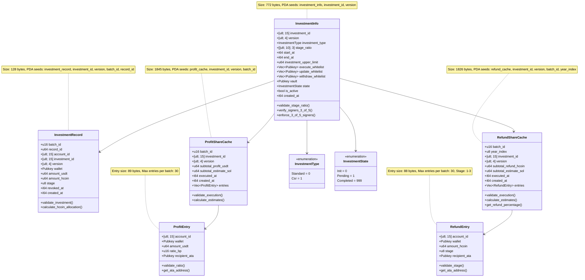

# 📜 State Specification: H2Coin Vault Share Protocol

This document describes the on-chain state accounts and data structures used in the H2Coin Vault Share Protocol. All account layouts are defined using the Anchor framework on Solana and are tightly packed for predictable space usage.

---

## 🧩 State Struct Overview

This section summarizes all on-chain state accounts and their purpose in the H2Coin Vault Share Protocol:

| State Account | Purpose |
| --- | --- |
| `InvestmentInfo` | Core configuration for an investment campaign, including whitelists, stage ratios, limits, and vault reference. |
| `InvestmentRecord` | Stores each individual investor's record for a specific investment, including USDT and H2COIN amounts. |
| `ProfitShareCache` | Caches the precomputed profit-sharing entries for one batch, preventing duplicate computation or execution. |
| `RefundShareCache` | Caches the estimated H2COIN refund entries for one batch-year based on the stage and year index. |

---

## 🧱 1. `InvestmentInfo` Account

Represents the core configuration of an investment campaign.

| Field | Type | Size (Bytes) | Description |
| --- | --- | --- | --- |
| `discriminator` | — | 8 | Anchor account discriminator |
| `investment_id` | `[u8; 15]` | 15 | Unique investment identifier |
| `version` | `[u8; 4]` | 4 | Program version or Git commit hash |
| `investment_type` | `InvestmentType` (enum) | 1 | Investment type: `Standard` or `Csr` |
| `stage_ratio` | `[[u8; 10]; MAX_STAGE]` | 30 | Refund/share ratio for each stage (3 × 10) |
| `start_at` | `i64` | 8 | Investment start timestamp |
| `end_at` | `i64` | 8 | Investment end timestamp |
| `investment_upper_limit` | `u64` | 8 | Max USDT accepted |
| `execute_whitelist` | `Vec<Pubkey>` | 4 + 32×5 = 164 | Pubkeys authorized to execute profit/refund |
| `update_whitelist` | `Vec<Pubkey>` | 4 + 32×5 = 164 | Pubkeys authorized to update config |
| `withdraw_whitelist` | `Vec<Pubkey>` | 4 + 32×5 = 164 | Pubkeys allowed to withdraw |
| `vault` | `Pubkey` | 32 | Vault PDA for funds |
| `state` | `InvestmentState` (`u16`) | 2 | Enum: `Init`, `Pending`, `Completed` |
| `is_active` | `bool` | 1 | Whether investment is active |
| `created_at` | `i64` | 8 | Creation timestamp |
| **Total** | — | **772** | Total account size |

### 🔄 `InvestmentType` Enum

Represents current investment progress.

| Variant | Value | Meaning |
| --- | --- | --- |
| `Standard` | `0` | Standard Type (default type) |
| `Csr` | `1` | Corporate Social Responsibility Type |

### 🔄 `InvestmentState` Enum

Represents current investment progress.

| Variant | Value | Meaning |
| --- | --- | --- |
| `Init` | `0` | Not yet active |
| `Pending` | `1` | Investment ongoing |
| `Completed` | `999` | Fully finalized |

#### **Constants**

*   `SIZE` = 772 bytes
*   `MAX_STAGE` = 3
*   `MAX_WHITELIST_LEN` = 5

#### **Methods**

*   `validate_stage_ratio()`

Ensures each investment stage contains contiguous non-zero entries and that the total sum of all stage ratios is less than or equal to 1000 (i.e., 100%).

```
pub fn validate_stage_ratio(&self) -> bool
```

*   `verify_signers_3_of_5(signer_keys: &[Pubkey], is_update: bool)`

Checks whether at least 3 out of 5 valid whitelist signers have signed the transaction. Selects the correct whitelist based on the `is_update` flag.

```
pub fn verify_signers_3_of_5(&self, signer_keys: &[Pubkey], is_update: bool) 
```

*   `enforce_3_of_5_signers<'info>(signer_infos: &[AccountInfo<'info>], is_update: bool) -> Result<()>`

Extracts signer public keys from `AccountInfo` and invokes `verify_signers_3_of_5`. Returns an error if signature requirement is not met.

```
pub fn enforce_3_of_5_signers<'info>(
    &self,
    signer_infos: &[AccountInfo<'info>],
    is_update: bool
) -> Result<()>
```

---

## 📊 2. `InvestmentRecord`

Tracks each individual's investment entry and stores a record of each investment unit made by an investor. 

| Field | Type | Size (Bytes) | Description |
| --- | --- | --- | --- |
| `discriminator` | — | 8 | Anchor discriminator |
| `batch_id` | `u16` | 2 | Batch grouping ID |
| `record_id` | `u64` | 8 | Unique investment record ID |
| `account_id` | `[u8; 15]` | 15 | Internal account reference |
| `investment_id` | `[u8; 15]` | 15 | Matching parent investment |
| `version` | `[u8; 4]` | 4 | Program version or Git commit hash |
| `wallet` | `Pubkey` | 32 | Investor wallet address |
| `amount_usdt` | `u64` | 8 | Invested amount in USDT |
| `amount_hcoin` | `u64` | 8 | Allocated H2COIN (optional) |
| `stage` | `u8` | 1 | Stage (1 ~ 3) |
| `revoked_at` | `i64` | 8 | Timestamp of revocation |
| `created_at` | `i64` | 8 | Record creation timestamp |
| **Total** | — | **128** | Total account size |

#### Constants

*    `Total SIZE` = 128 bytes

---

## 💰 3. `ProfitShareCache`

Stores the precomputed profit-sharing results for a specific batch.  
This cache prevents redundant computation and ensures that profit distribution is executed only once per batch.

| Field | Type | Size (Bytes) | Description |
| --- | --- | --- | --- |
| `discriminator` | — | 8 | Anchor discriminator |
| `batch_id` | `u16` | 2 | ALT batch ID |
| `investment_id` | `[u8; 15]` | 15 | Investment reference |
| `version` | `[u8; 4]` | 4 | Program version or Git commit hash |
| `subtotal_profit_usdt` | `u64` | 8 | Total USDT to distribute |
| `subtotal_estimate_sol` | `u64` | 8 | Estimated SOL to execute |
| `executed_at` | `i64` | 8 | Timestamp if executed |
| `created_at` | `i64` | 8 | Cache creation time |
| `entries (prefix)` | `Vec<ProfitEntry>` | 4 | Vec length prefix |
| `entries` | — | 57 × N | Profit entries (N ≤ `MAX_ENTRIES_PER_BATCH`) |
| **Total** | — | **1775** | Size with 30 entries |

### 🧾 `ProfitEntry` Struct (within `ProfitShareCache`)

Represents a single profit-sharing record inside a batch.

| Field | Type | Size (Bytes) | Description |
| --- | --- | --- | --- |
| `account_id` | `[u8; 15]` | 15 | Account ID |
| `wallet` | `Pubkey` | 32 | Wallet address |
| `amount_usdt` | `u64` | 8 | USDT share |
| `ratio_bp` | `u16` | 2 | Ratio in basis points |
| **Total** | — | **57** | Entry size |

#### Constants

*   `ENTRY_SIZE` = 57 bytes
*   `Basic SIZE` = 65 bytes
*   `Total SIZE` = 1775 bytes
*   `MAX_ENTRIES_PER_BATCH` = 30 entries

Returns the refund percentage based on stage and year index. Returns 0 if inputs are invalid.

---

## 🔁 4. `RefundShareCache`

Stores refund estimation by year and stage for one batch.

| Field | Type | Size (Bytes) | Description |
| --- | --- | --- | --- |
| `discriminator` | — | 8 | Anchor discriminator |
| `batch_id` | `u16` | 2 | ALT batch ID |
| `investment_id` | `[u8; 15]` | 15 | Investment reference |
| `version` | `[u8; 4]` | 4 | Program version or Git commit hash |
| `year_index` | `u8` | 1 | Refund year index |
| `subtotal_refund_hcoin` | `u64` | 8 | Total H2COIN to refund |
| `subtotal_estimate_sol` | `u64` | 8 | Estimated SOL to execute |
| `executed_at` | `i64` | 8 | Timestamp if executed |
| `created_at` | `i64` | 8 | Cache creation time |
| `entries (prefix)` | `Vec<RefundEntry>` | 4 | Vec length prefix |
| `entries` | — | 56 × N | Refund entries (N ≤ `MAX_ENTRIES_PER_BATCH`) |
| **Total** | — | **1746** | Size with 30 entries |

### 📑 `RefundEntry`

| Field | Type | Size (Bytes) | Description |
| --- | --- | --- | --- |
| `account_id` | `[u8; 15]` | 15 | Account ID |
| `wallet` | `Pubkey` | 32 | Wallet address |
| `amount_hcoin` | `u64` | 8 | H2COIN refund amount |
| `stage` | `u8` | 1 | Investment stage |
| **Total** | — | **56** | Entry size |

#### Constants

*   `ENTRY_SIZE` = 56 bytes
*   `Basic SIZE` = 66 bytes
*   `Total SIZE` = 1746 bytes
*   `MAX_ENTRIES_PER_BATCH` = 30 entries

Returns the refund percentage based on stage and year index. Returns 0 if inputs are invalid.

#### Method

```
fn get_refund_percentage(stage_ratio: &[[u8; 10]; 3], stage: u8, year_index: u8) -> u8
```

Returns the refund percentage based on stage and year index. Returns 0 if inputs are invalid.

## 📊 State Class Diagram

### Mermaid Source


### Diagram
