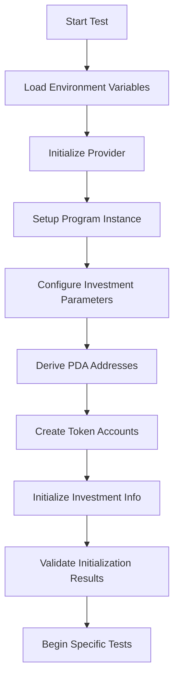
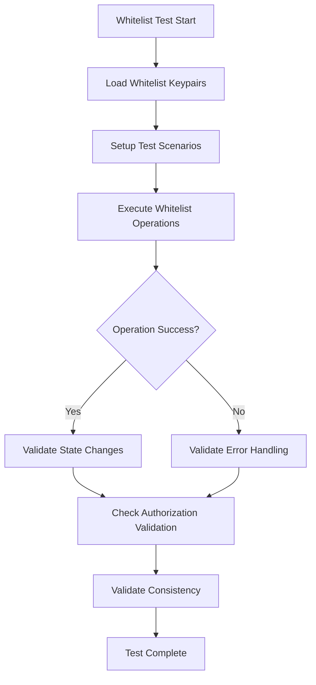
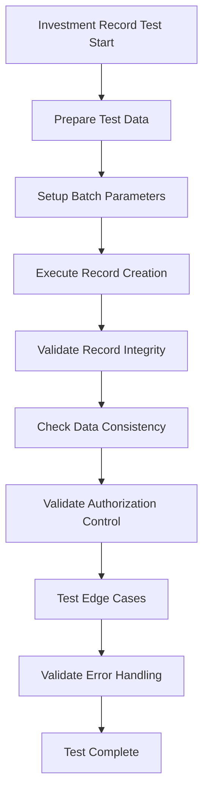
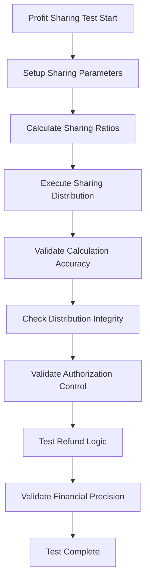

# H2Coin Vault Share Program - Test Architecture and Security Audit Guide

## Overview

This document provides a comprehensive description of the H2Coin Vault Share program's test architecture, security considerations, and complete test suite prepared for BlockApex audit. All test code includes detailed English audit comments to assist security audit work.

## Test Architecture

### 1. Core Components

#### 1.1 Runtime Configuration (`tests/devnet.runtime.ts`)
- **Functionality**: Provides global test environment configuration and initialization
- **Security Considerations**:
  - Program state and configuration management
  - Sensitive key management and PDA derivation
  - Global test utilities and state resolution
- **Audit Focus Areas**:
  - Proper key management and derivation
  - State initialization security
  - Global variable usage patterns

#### 1.2 Utility Library (`tests/lib/lib.ts`)
- **Functionality**: Provides data conversion, keypair management, file operations, and test infrastructure support
- **Security Considerations**:
  - Handles sensitive keypair loading and generation
  - Manages whitelist keypair access control
  - Processes binary data and string conversions
  - Provides transaction event parsing capabilities
- **Audit Focus Areas**:
  - Secure keypair handling and storage
  - File system access patterns
  - Data validation and sanitization
  - Memory management for large datasets

#### 1.3 Provider Configuration (`src/utils/provider.ts`)
- **Functionality**: Centralized provider configuration including wallet management, connection setup, and environment variable validation
- **Security Considerations**:
  - Manages sensitive wallet keypair loading from filesystem
  - Handles environment variable validation and configuration
  - Provides secure connection setup for program operations
- **Audit Focus Areas**:
  - Secure wallet keypair handling and storage
  - Environment variable security and validation
  - Connection configuration security

### 2. Whitelist Management Test Suites

#### 2.1 Execute Whitelist Tests (`tests/devnet.execute_whitelist.test.ts`)
- **Functionality**: Validates execute whitelist functionality including initialization, whitelist patching, and access control mechanisms for investment execution
- **Test Scenarios**:
  - Replace existing key with other existing key
  - Replace existing key with self
  - Replace existing key with new key
  - Reset to original whitelist
- **Security Considerations**:
  - Tests whitelist-based access control for investment execution
  - Validates multi-signature requirements for whitelist modifications
  - Ensures proper authorization checks for whitelist operations
- **Audit Focus Areas**:
  - Access control mechanism effectiveness
  - Multi-signature validation
  - Whitelist state consistency
  - Authorization bypass prevention

#### 2.2 Update Whitelist Tests (`tests/devnet.update_whitelist.test.ts`)
- **Functionality**: Validates update whitelist functionality including initialization, whitelist patching, and access control mechanisms for investment information updates
- **Security Considerations**:
  - Tests whitelist-based access control for investment updates
  - Validates multi-signature requirements for whitelist modifications
  - Ensures proper authorization checks for update operations
- **Audit Focus Areas**:
  - Update permission access control mechanism effectiveness
  - Multi-signature validation for update operations
  - Update whitelist state consistency

#### 2.3 Withdraw Whitelist Tests (`tests/devnet.withdraw_whitelist.test.ts`)
- **Functionality**: Validates withdraw whitelist functionality including initialization, whitelist patching, and access control mechanisms for fund withdrawal permissions
- **Security Considerations**:
  - Tests whitelist-based access control for fund withdrawals
  - Validates multi-signature requirements for whitelist modifications
  - Ensures proper authorization checks for withdrawal operations
- **Audit Focus Areas**:
  - Withdrawal permission access control mechanism effectiveness
  - Multi-signature validation for withdrawal operations
  - Withdraw whitelist state consistency

### 3. Investment Management Test Suites

#### 3.1 Investment Info Tests (`tests/devnet.investment_info.test.ts`)
- **Functionality**: Validates investment information functionality including initialization, state management, and access control mechanisms for investment configuration
- **Test Scenarios**:
  - Initialize investment info
  - Fail to initialize investment info when already initialized
- **Security Considerations**:
  - Tests investment information initialization and validation
  - Validates state transitions and lifecycle management
  - Ensures proper authorization checks for investment operations
- **Audit Focus Areas**:
  - Investment state initialization security
  - State transition validation and consistency
  - Authorization bypass prevention for investment operations

#### 3.2 Investment Record Tests Part 1 (`tests/devnet.investment_record.test1.ts`)
- **Functionality**: Validates investment record functionality including batch operations, record management, and access control mechanisms for investment tracking
- **Test Scenarios**:
  - Add new investment records in batch mode
- **Security Considerations**:
  - Tests investment record creation and batch processing
  - Validates record integrity and data consistency
  - Ensures proper authorization checks for record operations
- **Audit Focus Areas**:
  - Investment record creation security and validation
  - Batch processing integrity and consistency
  - Authorization bypass prevention for record operations

#### 3.3 Investment Record Tests Part 2 (`tests/devnet.investment_record.test2.ts`)
- **Functionality**: Validates advanced investment record functionality including complex operations, record validation, and comprehensive access control mechanisms for investment tracking
- **Security Considerations**:
  - Tests advanced investment record operations and validation
  - Validates complex record integrity and data consistency scenarios
  - Ensures comprehensive authorization checks for record operations
- **Audit Focus Areas**:
  - Advanced investment record operation security and validation
  - Complex batch processing integrity and consistency
  - Comprehensive authorization bypass prevention for record operations

### 4. Profit and Refund Management Test Suite

#### 4.1 Profit Refund Share Tests (`tests/devnet.profit_refund_share.test.ts`)
- **Functionality**: Validates profit sharing and refund functionality including distribution, calculation mechanisms, and access control for profit/refund operations
- **Security Considerations**:
  - Tests profit sharing calculation and distribution mechanisms
  - Validates refund processing and distribution logic
  - Ensures proper authorization checks for profit/refund operations
- **Audit Focus Areas**:
  - Profit sharing calculation accuracy and security
  - Refund distribution integrity and consistency
  - Authorization bypass prevention for profit/refund operations
  - Financial calculation validation and precision

### 5. Infrastructure Tests

#### 5.1 Cluster Connection Tests (`src/tests/cluster-test.ts`)
- **Functionality**: Validates cluster connection functionality including provider setup, wallet connection, and basic cluster interaction for the H2Coin program
- **Security Considerations**:
  - Tests cluster connection and provider initialization
  - Validates wallet connection and balance retrieval
  - Ensures proper network connectivity for program operations
- **Audit Focus Areas**:
  - Cluster connection security and reliability
  - Provider initialization and configuration
  - Wallet connection validation

## Test Flow and Logic

### 1. Initialization Flow



### 2. Whitelist Management Flow



### 3. Investment Record Management Flow



### 4. Profit Sharing Flow



## Security Audit Focus Areas

### 1. Access Control
- **Whitelist Mechanisms**: Validate whitelist effectiveness for different operation types
- **Multi-signature Requirements**: Ensure critical operations require appropriate number of signatures
- **Permission Separation**: Validate separation of execute, update, and withdrawal permissions
- **Authorization Bypass**: Test mechanisms to prevent unauthorized access

### 2. Data Integrity
- **State Consistency**: Ensure program state remains consistent after all operations
- **Data Validation**: Validate input data format and range
- **Edge Case Handling**: Test data processing under extreme conditions
- **Error Handling**: Ensure data protection during error conditions

### 3. Financial Security
- **Calculation Precision**: Validate accuracy of financial calculations
- **Balance Verification**: Ensure correct token balances
- **Overflow Protection**: Prevent numerical overflow attacks
- **Reentrancy Protection**: Prevent reentrancy attacks

### 4. Key Management
- **Key Storage**: Validate secure key storage
- **Key Rotation**: Test key rotation mechanisms
- **Key Validation**: Ensure key validity
- **Key Leakage Prevention**: Prevent key leakage protection mechanisms

### 5. Network Security
- **Connection Security**: Validate network connection security
- **Transaction Validation**: Ensure transaction validity
- **Replay Attack Prevention**: Prevent replay attacks
- **Denial of Service Prevention**: Prevent denial of service attacks

## Audit Comment Standards

### 1. File-level Comments
```typescript
/**
 * @fileoverview [File functionality description]
 * [Detailed functionality explanation]
 * 
 * SECURITY CONSIDERATIONS:
 * - [Security consideration point 1]
 * - [Security consideration point 2]
 * 
 * @audit [Audit focus explanation]
 */
```

### 2. Function-level Comments
```typescript
/**
 * [Function description]
 * 
 * @param [parameter name] - [Parameter description]
 * @returns [Return value description]
 * 
 * @audit [Audit focus]
 */
```

### 3. Security Warning Comments
```typescript
// @audit SECURITY CRITICAL: [Security warning description]
```

## Test Execution Guide

### 1. Environment Setup
1. Ensure `.env` file contains necessary environment variables
2. Install all dependency packages
3. Configure Solana cluster connection
4. Prepare test keypairs

### 2. Test Execution Order
1. Run infrastructure tests (`cluster-test.ts`)
2. Execute initialization tests (`investment_info.test.ts`)
3. Run whitelist management tests
4. Execute investment record tests
5. Run profit sharing tests

### 3. Test Validation
- Check all tests pass
- Validate program state consistency
- Confirm error handling is correct
- Check security mechanism effectiveness

## Conclusion

This test suite provides comprehensive security validation for the H2Coin Vault Share program, including detailed audit comments to assist BlockApex in conducting security audits. All tests are carefully designed to cover critical security considerations and provide clear execution flow and logic explanations.

Through these tests and comments, auditors can:
- Understand the program's security architecture
- Validate critical security mechanisms
- Identify potential security risks
- Confirm program correctness and reliability

It is recommended to conduct comprehensive security assessments by combining this document with code comments during security audits. 